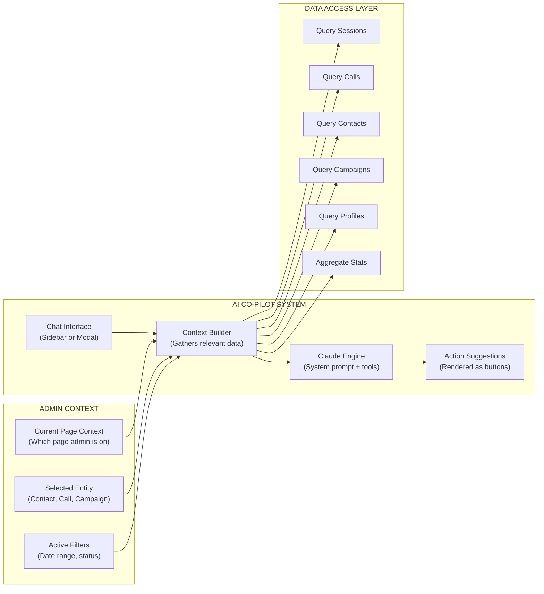

# HMN Cascade - Complete Data Flow Architecture & Wiring Audit

## Context

This document maps every module in HMN Cascade, shows what's currently wired, flags what's broken or missing, defines the target architecture with merged Adaptability Index, and specifies exactly how the admin-facing AI Co-pilot should connect to everything.

---

## 1. CURRENT STATE - Data Flow Diagram

```mermaid
flowchart TB
    subgraph USER_FACING["USER-FACING ASSESSMENT"]
        WEB_CLIENT["Web Interview Client<br/>(QuestionCard, VoiceRecorder)"]
        ADAPT_CLIENT["Adaptability Index Client<br/>(Chat Interface)"]
        RESULTS["Results Page<br/>(/interview/[id]/results)"]
    end

    subgraph API_LAYER["API ROUTES"]
        INT_START["/api/interview/start"]
        INT_RESPOND["/api/interview/respond"]
        INT_ANALYZE["/api/interview/analyze"]
        ADAPT_SESSION["/api/adaptability/session"]
        ADAPT_CHAT["/api/adaptability/chat"]
        ADAPT_SCORE["/api/adaptability/score"]
        VAPI_HOOK["/api/vapi/webhook"]
        ADMIN_CALLS["/api/admin/calls/initiate"]
        ADMIN_CAMPAIGNS["/api/admin/campaigns"]
        ADMIN_CONTACTS["/api/admin/contacts"]
        ADMIN_ANALYTICS["/api/admin/analytics"]
        ADMIN_SEARCH["/api/admin/search"]
        ADMIN_WEBHOOKS["/api/admin/webhooks"]
        ADMIN_SETTINGS["/api/admin/settings"]
        ADMIN_ORGS["/api/admin/organizations"]
        REPORTS["/api/reports/[sessionId]"]
        CRON_SCHED["/api/cron/check-scheduled"]
        CRON_CLEAN["/api/cron/cleanup"]
    end

    subgraph ENGINE["CORE ENGINE"]
        ANTHROPIC["anthropic.ts<br/>(Claude AI)"]
        SESSIONS["sessions.ts<br/>(Session CRUD)"]
        SCORING["scoring.ts<br/>(8-dim scoring)"]
        QBANK["question-bank.ts<br/>(40 questions)"]
        RUBRICS["scoring-rubrics.ts<br/>(Archetypes/Gaps)"]
        ADAPT_AGENT["adaptability-agent.ts<br/>(Claude Agentic)"]
        ADAPT_SCORING["adaptability-scoring.ts<br/>(4-pillar scoring)"]
    end

    subgraph VOICE["VOICE CALLING"]
        VAPI_OUT["vapi-outbound.ts"]
        CALL_PIPE["call-pipeline.ts<br/>(10-step pipeline)"]
        TRANSCRIPT["transcript-parser.ts"]
        DEEPGRAM["deepgram.ts"]
    end

    subgraph INTEGRATIONS["INTEGRATIONS"]
        ENRICH["enrichment.ts<br/>(Firecrawl)"]
        EMAIL["email.ts<br/>(Resend)"]
        WEBHOOK_DISP["webhook-dispatcher.ts"]
        EVENT_BUS["event-bus.ts<br/>(In-memory pub/sub)"]
        CSV["csv-export.ts"]
        RETENTION["data-retention.ts"]
    end

    subgraph EXTERNAL["EXTERNAL SERVICES"]
        VAPI_API["Vapi Voice API"]
        CLAUDE_API["Claude Sonnet 4.6"]
        SUPABASE["Supabase (PostgreSQL)"]
        RESEND["Resend Email"]
        FIRECRAWL["Firecrawl API"]
        EXT_WEBHOOKS["External Webhook Consumers"]
    end

    subgraph ADMIN_UI["ADMIN DASHBOARD"]
        DASH["Dashboard<br/>(/admin)"]
        CALLS_PAGE["Calls<br/>(/admin/calls)"]
        CAMP_PAGE["Campaigns<br/>(/admin/campaigns)"]
        CONTACTS_PAGE["Contacts<br/>(/admin/contacts)"]
        ORGS_PAGE["Organizations<br/>(/admin/organizations)"]
        ANALYTICS_PAGE["Analytics<br/>(/admin/analytics)"]
        SEARCH_PAGE["Search<br/>(/admin/search)"]
        WEBHOOKS_PAGE["Webhooks<br/>(/admin/webhooks)"]
        SETTINGS_PAGE["Settings<br/>(/admin/settings)"]
    end

    subgraph DB["DATABASE TABLES"]
        DB_SESSIONS[("hmn_sessions")]
        DB_CALLS[("hmn_calls")]
        DB_CONTACTS[("hmn_contacts")]
        DB_CAMPAIGNS[("hmn_call_campaigns")]
        DB_PROFILES[("hmn_profiles")]
        DB_WEBHOOKS[("hmn_webhooks")]
    end

    %% Web Interview Flow
    WEB_CLIENT --> INT_START --> SESSIONS --> DB_SESSIONS
    WEB_CLIENT --> INT_RESPOND --> ANTHROPIC --> CLAUDE_API
    INT_RESPOND --> SESSIONS
    INT_RESPOND --> QBANK
    WEB_CLIENT --> INT_ANALYZE --> SCORING --> ANTHROPIC
    SCORING --> RUBRICS
    INT_ANALYZE --> SESSIONS
    INT_ANALYZE --> DB_SESSIONS
    RESULTS --> REPORTS --> DB_SESSIONS

    %% Voice Call Flow
    ADMIN_CALLS --> VAPI_OUT --> VAPI_API
    VAPI_OUT --> DB_CALLS
    VAPI_API --> VAPI_HOOK --> CALL_PIPE
    CALL_PIPE --> TRANSCRIPT --> ANTHROPIC
    CALL_PIPE --> SCORING
    CALL_PIPE --> DB_CALLS
    CALL_PIPE --> DB_PROFILES
    CALL_PIPE --> DB_CONTACTS
    CALL_PIPE --> EMAIL --> RESEND
    CALL_PIPE --> WEBHOOK_DISP --> EXT_WEBHOOKS
    VAPI_HOOK --> EVENT_BUS --> DASH

    %% Adaptability Flow (DISCONNECTED)
    ADAPT_CLIENT --> ADAPT_SESSION --> ENRICH --> FIRECRAWL
    ADAPT_CLIENT --> ADAPT_CHAT --> ADAPT_AGENT --> CLAUDE_API
    ADAPT_CLIENT --> ADAPT_SCORE --> ADAPT_SCORING

    %% Campaign Flow
    CAMP_PAGE --> ADMIN_CAMPAIGNS --> DB_CAMPAIGNS
    ADMIN_CAMPAIGNS --> DB_CONTACTS
    CRON_SCHED --> ADMIN_CALLS

    %% Admin Pages
    DASH --> ADMIN_CALLS
    DASH --> ADMIN_CAMPAIGNS
    CALLS_PAGE --> ADMIN_CALLS --> DB_CALLS
    CONTACTS_PAGE --> ADMIN_CONTACTS --> DB_CONTACTS
    ORGS_PAGE --> ADMIN_ORGS --> DB_CONTACTS
    ANALYTICS_PAGE --> ADMIN_ANALYTICS --> DB_SESSIONS
    ADMIN_ANALYTICS --> DB_CALLS
    ADMIN_ANALYTICS --> DB_PROFILES
    SEARCH_PAGE --> ADMIN_SEARCH --> DB_SESSIONS
    ADMIN_SEARCH --> DB_CALLS
    ADMIN_SEARCH --> DB_CONTACTS
    WEBHOOKS_PAGE --> ADMIN_WEBHOOKS --> DB_WEBHOOKS
    SETTINGS_PAGE --> ADMIN_SETTINGS --> RETENTION
    CRON_CLEAN --> RETENTION --> SUPABASE

    %% CSV
    CONTACTS_PAGE --> CSV
```



---

## 2. GAP AUDIT - What's Broken or Missing

### CRITICAL GAPS (Data Dead Ends)

| # | Gap | Impact | Details |
|---|-----|--------|---------|
| 1 | **Web interviews don't create Profile rows** | Sessions complete but results never appear in analytics, search, or org views | `/api/interview/analyze` saves analysis to `hmn_sessions` but never inserts into `hmn_profiles`. The call pipeline does this (step 7) but web flow doesn't. |
| 2 | **Web sessions have no contact_id link** | Can't connect a web assessment to a contact, company, or campaign | `hmn_sessions` has `participant_name/email/company` as flat strings but no FK to `hmn_contacts`. Profiles created from calls have `contact_id`, web ones don't. |
| 3 | **Adaptability Index is fully disconnected** | Results from adaptability assessments don't feed into profiles, analytics, or any admin view | Adaptability scoring endpoint writes to profiles with `contact_id: null`, no webhook dispatch, no email notifications, no event bus emission. |
| 4 | **No webhooks fire for web assessments** | External integrations only get notified about voice call completions | `webhook-dispatcher.ts` is only called from `call-pipeline.ts`. Web interview completion skips webhooks entirely. |
| 5 | **No email notifications for web assessments** | Admins don't get notified when someone completes a web-based assessment | `email.ts` `sendAssessmentComplete()` is only called from `call-pipeline.ts`. |

### HIGH GAPS (Missing Connections)

| # | Gap | Impact |
|---|-----|--------|
| 6 | **Organizations page can't see assessment results** | Company view shows contacts but not their scores, archetypes, or gaps |
| 7 | **Calls page can't link to session analysis** | Admin sees transcript but can't navigate to the full scored analysis |
| 8 | **Dashboard has no session stats** | Dashboard shows call/campaign stats but nothing about web-based interviews |
| 9 | **Analytics doesn't aggregate by archetype or gap** | Analytics page queries sessions/calls but doesn't break down by the 8 archetypes or 7 gap patterns |
| 10 | **Search doesn't index profiles** | Full-text search covers sessions, calls, contacts but not profile data (archetypes, scores) |
| 11 | **No comparison flow from admin** | `/compare` route exists for participants but admin can't compare two contacts' results side-by-side |
| 12 | **Enrichment (Firecrawl) only used in Adaptability** | LinkedIn/company enrichment could pre-fill contact data for all assessments but is only wired to adaptability sessions |

### MEDIUM GAPS (UX Disconnects)

| # | Gap | Impact |
|---|-----|--------|
| 13 | **Campaign → Results navigation missing** | No drill-down from campaign completion to aggregated results for that campaign |
| 14 | **Contact → Assessment history missing** | Contact detail page doesn't show past sessions or call results |
| 15 | **No assessment template management UI** | `assessment-templates.ts` exists in lib but no admin page to manage templates |
| 16 | **Event bus is ephemeral** | Real-time updates only work if admin has page open; missed events are lost |
| 17 | **No CSV export from profiles** | `csv-export.ts` exists but isn't wired to export profile/archetype data |

---

## 3. TARGET STATE - Data Flow Diagram (With All Fixes + AI Co-pilot)

```mermaid
flowchart TB
    subgraph USER_FACING["USER-FACING ASSESSMENT"]
        WEB_CLIENT["Web Interview<br/>(Cascade + Adaptability merged)"]
        RESULTS["Results Page"]
    end

    subgraph COPILOT["AI CO-PILOT (Admin)"]
        CP_CHAT["Co-pilot Chat Interface"]
        CP_ENGINE["Co-pilot Engine<br/>(Claude with full context)"]
        CP_ACTIONS["Co-pilot Actions<br/>(Suggest, Summarize, Query)"]
    end

    subgraph API_LAYER["API ROUTES"]
        INT_START["/api/interview/start"]
        INT_RESPOND["/api/interview/respond"]
        INT_ANALYZE["/api/interview/analyze"]
        VAPI_HOOK["/api/vapi/webhook"]
        ADMIN_CALLS["/api/admin/calls/initiate"]
        ADMIN_CAMPAIGNS["/api/admin/campaigns"]
        ADMIN_CONTACTS["/api/admin/contacts"]
        ADMIN_ANALYTICS["/api/admin/analytics"]
        ADMIN_SEARCH["/api/admin/search"]
        ADMIN_WEBHOOKS["/api/admin/webhooks"]
        ADMIN_SETTINGS["/api/admin/settings"]
        ADMIN_ORGS["/api/admin/organizations"]
        CP_API["/api/admin/copilot"]
        REPORTS["/api/reports/[sessionId]"]
    end

    subgraph ENGINE["UNIFIED SCORING ENGINE"]
        ANTHROPIC["anthropic.ts<br/>(Claude AI)"]
        SESSIONS["sessions.ts<br/>(Session CRUD)"]
        SCORING["unified-scoring.ts<br/>(8 Cascade dims + 4 Adaptability pillars)"]
        QBANK["question-bank.ts<br/>(Cascade + Adaptability Qs)"]
        RUBRICS["scoring-rubrics.ts<br/>(Extended archetypes)"]
        COMPLETION["assessment-completion.ts<br/>(Unified post-assessment pipeline)"]
    end

    subgraph VOICE["VOICE CALLING"]
        VAPI_OUT["vapi-outbound.ts"]
        CALL_PIPE["call-pipeline.ts"]
        TRANSCRIPT["transcript-parser.ts"]
    end

    subgraph INTEGRATIONS["INTEGRATIONS"]
        ENRICH["enrichment.ts<br/>(ALL assessments)"]
        EMAIL["email.ts"]
        WEBHOOK_DISP["webhook-dispatcher.ts"]
        EVENT_BUS["event-bus.ts"]
        CSV["csv-export.ts"]
        RETENTION["data-retention.ts"]
    end

    subgraph EXTERNAL["EXTERNAL SERVICES"]
        VAPI_API["Vapi Voice API"]
        CLAUDE_API["Claude Sonnet 4.6"]
        SUPABASE["Supabase"]
        RESEND["Resend"]
        FIRECRAWL["Firecrawl"]
        EXT_WEBHOOKS["External Consumers"]
    end

    subgraph ADMIN_UI["ADMIN DASHBOARD"]
        DASH["Dashboard"]
        CALLS_PAGE["Calls"]
        CAMP_PAGE["Campaigns"]
        CONTACTS_PAGE["Contacts"]
        ORGS_PAGE["Organizations"]
        ANALYTICS_PAGE["Analytics"]
        SEARCH_PAGE["Search"]
        WEBHOOKS_PAGE["Webhooks"]
        SETTINGS_PAGE["Settings"]
        TEMPLATES_PAGE["Assessment Templates"]
    end

    subgraph DB["DATABASE"]
        DB_SESSIONS[("hmn_sessions<br/>+contact_id<br/>+assessment_type")]
        DB_CALLS[("hmn_calls")]
        DB_CONTACTS[("hmn_contacts")]
        DB_CAMPAIGNS[("hmn_call_campaigns")]
        DB_PROFILES[("hmn_profiles<br/>+adaptability_scores<br/>+assessment_type")]
        DB_WEBHOOKS[("hmn_webhooks")]
        DB_CP_LOGS[("hmn_copilot_logs")]
    end

    %% ===== UNIFIED WEB ASSESSMENT FLOW =====
    WEB_CLIENT --> INT_START --> SESSIONS --> DB_SESSIONS
    WEB_CLIENT --> INT_RESPOND --> ANTHROPIC --> CLAUDE_API
    INT_RESPOND --> QBANK
    WEB_CLIENT --> INT_ANALYZE --> COMPLETION
    COMPLETION --> SCORING --> ANTHROPIC
    SCORING --> RUBRICS
    COMPLETION --> DB_SESSIONS
    COMPLETION --> DB_PROFILES
    COMPLETION --> WEBHOOK_DISP --> EXT_WEBHOOKS
    COMPLETION --> EMAIL --> RESEND
    COMPLETION --> EVENT_BUS
    RESULTS --> REPORTS --> DB_PROFILES

    %% ===== VOICE CALL FLOW =====
    ADMIN_CALLS --> VAPI_OUT --> VAPI_API
    VAPI_API --> VAPI_HOOK --> CALL_PIPE --> COMPLETION
    CALL_PIPE --> TRANSCRIPT --> ANTHROPIC
    CALL_PIPE --> DB_CALLS
    VAPI_HOOK --> EVENT_BUS

    %% ===== ENRICHMENT (ALL FLOWS) =====
    INT_START --> ENRICH --> FIRECRAWL
    ADMIN_CALLS --> ENRICH

    %% ===== CAMPAIGN FLOW =====
    CAMP_PAGE --> ADMIN_CAMPAIGNS --> DB_CAMPAIGNS
    ADMIN_CAMPAIGNS --> DB_CONTACTS

    %% ===== AI CO-PILOT =====
    CP_CHAT --> CP_API --> CP_ENGINE --> CLAUDE_API
    CP_ENGINE --> DB_SESSIONS
    CP_ENGINE --> DB_CALLS
    CP_ENGINE --> DB_CONTACTS
    CP_ENGINE --> DB_CAMPAIGNS
    CP_ENGINE --> DB_PROFILES
    CP_ENGINE --> DB_CP_LOGS
    CP_ACTIONS --> ADMIN_ANALYTICS
    CP_ACTIONS --> ADMIN_CONTACTS
    CP_ACTIONS --> ADMIN_CAMPAIGNS

    %% ===== ADMIN PAGES (ALL READ FROM PROFILES) =====
    DASH --> DB_PROFILES
    DASH --> DB_CALLS
    DASH --> DB_SESSIONS
    DASH --> DB_CAMPAIGNS
    CALLS_PAGE --> DB_CALLS
    CALLS_PAGE --> DB_PROFILES
    CONTACTS_PAGE --> DB_CONTACTS
    CONTACTS_PAGE --> DB_PROFILES
    ORGS_PAGE --> DB_CONTACTS
    ORGS_PAGE --> DB_PROFILES
    ANALYTICS_PAGE --> DB_PROFILES
    ANALYTICS_PAGE --> DB_SESSIONS
    ANALYTICS_PAGE --> DB_CALLS
    SEARCH_PAGE --> DB_SESSIONS
    SEARCH_PAGE --> DB_CALLS
    SEARCH_PAGE --> DB_CONTACTS
    SEARCH_PAGE --> DB_PROFILES
    WEBHOOKS_PAGE --> DB_WEBHOOKS
    SETTINGS_PAGE --> RETENTION

    %% ===== EVENT BUS REAL-TIME =====
    EVENT_BUS --> DASH
    EVENT_BUS --> CP_CHAT

    %% ===== CSV EXPORT =====
    ANALYTICS_PAGE --> CSV
    CONTACTS_PAGE --> CSV
```



---

## 4. AI CO-PILOT WIRING SPECIFICATION

The Co-pilot is an admin-facing chat interface that has read access to ALL data and can suggest actions. It connects as a horizontal layer across all modules.

### Co-pilot Architecture



### Co-pilot Per-Module Capabilities

| Module | Co-pilot Can Do | Data It Reads | Actions It Can Suggest |
|--------|----------------|---------------|----------------------|
| **Dashboard** | Summarize today's activity, highlight anomalies, predict pipeline | sessions, calls, campaigns, profiles | "Focus on Campaign X - 3 calls need review" |
| **Sessions** | Explain results, compare participants, flag contradictions | sessions, profiles, question-bank | "This participant's ai_awareness vs ai_action gap suggests they need hands-on workshops" |
| **Calls** | Analyze transcripts, flag concerns, identify coaching moments | calls, transcripts, profiles | "Replay at 4:32 - participant showed strong resistance to change" |
| **Campaigns** | Predict completion, suggest call windows, identify low-response segments | campaigns, contacts, calls, profiles | "Move remaining 12 contacts to afternoon window - 23% higher pickup rate" |
| **Contacts** | Enrich profiles, suggest who to call next, prioritize outreach | contacts, profiles, enrichment data | "These 5 contacts in fintech have the highest predicted AI readiness" |
| **Organizations** | Company-level insights, benchmark against industry, aggregate gaps | contacts (grouped by company), profiles | "Acme Corp's team shows a consistent strategy-process gap across 4 assessments" |
| **Analytics** | Natural language queries, trend analysis, export insights | all tables aggregated | "Show me archetype distribution for tech companies this quarter" |
| **Assessments** | Suggest question modifications, identify low-signal questions | question-bank, responses, scoring data | "Question 23 has low variance - consider rewording for more signal" |
| **Search** | Semantic search, find similar profiles, pattern matching | all tables | "Find all participants who scored high on vision but low on execution" |
| **Webhooks** | Suggest integrations, debug delivery failures | webhooks, webhook logs | "Your Salesforce webhook failed 3 times - check the endpoint URL" |
| **Settings** | Recommend retention policies, estimate storage impact | retention config, table sizes | "You have 847 sessions older than 90 days consuming 2.3GB" |

---

## 5. COMPLETE WIRING SPECIFICATION TABLE

### Module-to-Module Connections

| # | Source | Target | Data Exchanged | Current Status | Priority |
|---|--------|--------|----------------|----------------|----------|
| 1 | Web Interview | hmn_sessions | Session state, responses, analysis | **Wired** | - |
| 2 | Web Interview | hmn_profiles | Profile row with scores/archetype | **NOT WIRED** | Critical |
| 3 | Web Interview | hmn_contacts | Link session to contact | **NOT WIRED** | Critical |
| 4 | Web Interview | webhook-dispatcher | Fire assessment_completed event | **NOT WIRED** | Critical |
| 5 | Web Interview | email.ts | Send completion notification | **NOT WIRED** | Critical |
| 6 | Web Interview | event-bus | Emit session_completed event | **NOT WIRED** | High |
| 7 | Web Interview | enrichment.ts | Pre-fill context from LinkedIn | **NOT WIRED** | Medium |
| 8 | Voice Call | hmn_calls | Call record, transcript, recording | **Wired** | - |
| 9 | Voice Call | hmn_profiles | Profile row from call analysis | **Wired** | - |
| 10 | Voice Call | hmn_contacts | Update contact status | **Wired** | - |
| 11 | Voice Call | webhook-dispatcher | Fire call events | **Wired** | - |
| 12 | Voice Call | email.ts | Send completion email | **Wired** | - |
| 13 | Voice Call | event-bus | Real-time call status | **Wired** | - |
| 14 | Adaptability | hmn_profiles | Profile with adaptability scores | **Partially** (no contact_id) | Critical |
| 15 | Adaptability | hmn_sessions | Merge into session flow | **NOT WIRED** | Critical |
| 16 | Adaptability | webhook-dispatcher | Fire events | **NOT WIRED** | High |
| 17 | Adaptability | email.ts | Send completion email | **NOT WIRED** | High |
| 18 | Adaptability | event-bus | Emit events | **NOT WIRED** | High |
| 19 | Dashboard | hmn_sessions | Session count & status | **Partially** (calls only) | High |
| 20 | Dashboard | hmn_profiles | Score distributions, archetypes | **NOT WIRED** | High |
| 21 | Dashboard | event-bus | Real-time updates | **Wired** (calls only) | - |
| 22 | Calls Page | hmn_profiles | Link to scored analysis | **NOT WIRED** | High |
| 23 | Contacts Page | hmn_profiles | Show assessment history | **NOT WIRED** | High |
| 24 | Contacts Page | hmn_sessions | Show session history | **NOT WIRED** | High |
| 25 | Organizations | hmn_profiles | Company-level score aggregation | **NOT WIRED** | High |
| 26 | Analytics | hmn_profiles | Archetype/gap breakdowns | **NOT WIRED** | High |
| 27 | Analytics | csv-export | Export profile data | **NOT WIRED** | Medium |
| 28 | Search | hmn_profiles | Search by archetype/score | **NOT WIRED** | Medium |
| 29 | Campaigns | hmn_profiles | Campaign results aggregation | **NOT WIRED** | High |
| 30 | Settings | Assessment Templates | Template management UI | **NOT WIRED** | Medium |
| 31 | Co-pilot | All tables | Read access for queries | **NOT BUILT** | High |
| 32 | Co-pilot | Claude API | Analysis and suggestions | **NOT BUILT** | High |
| 33 | Co-pilot | event-bus | Real-time context updates | **NOT BUILT** | Medium |
| 34 | Co-pilot | hmn_copilot_logs | Conversation history | **NOT BUILT** | Medium |

### Database Schema Changes Needed

```
-- Add to hmn_sessions
ALTER TABLE hmn_sessions ADD COLUMN contact_id UUID REFERENCES hmn_contacts(id);
ALTER TABLE hmn_sessions ADD COLUMN assessment_type TEXT DEFAULT 'cascade'; -- 'cascade' | 'adaptability' | 'combined'

-- Add to hmn_profiles
ALTER TABLE hmn_profiles ADD COLUMN assessment_type TEXT DEFAULT 'cascade';
ALTER TABLE hmn_profiles ADD COLUMN adaptability_scores JSONB; -- 4 pillars when applicable

-- New table for co-pilot
CREATE TABLE hmn_copilot_logs (
  id UUID PRIMARY KEY DEFAULT gen_random_uuid(),
  admin_email TEXT NOT NULL,
  page_context TEXT, -- which admin page
  entity_id UUID, -- what entity was selected
  query TEXT NOT NULL,
  response TEXT NOT NULL,
  actions_suggested JSONB,
  created_at TIMESTAMPTZ DEFAULT NOW()
);
```

---

## 6. IMPLEMENTATION PRIORITIES

### Phase 1: Fix Critical Data Dead Ends
1. Create `assessment-completion.ts` - unified post-assessment pipeline (mirrors call-pipeline.ts steps 6-10)
2. Wire `/api/interview/analyze` to create profile rows
3. Add `contact_id` to `hmn_sessions` schema
4. Wire web assessments to webhook-dispatcher and email.ts
5. Wire Adaptability scoring into the unified pipeline

### Phase 2: Connect Admin Pages to Profiles
6. Dashboard: Add session stats + profile score distributions
7. Calls Page: Link to profile analysis view
8. Contacts Page: Show assessment history per contact
9. Organizations Page: Aggregate profiles by company
10. Analytics: Add archetype/gap breakdown charts
11. Search: Index profiles (archetype, score ranges)
12. Campaigns: Show aggregated results per campaign

### Phase 3: Build AI Co-pilot
13. Create `/api/admin/copilot` endpoint
14. Build Co-pilot context builder (reads current page + selected entity + filters)
15. Build Co-pilot chat interface (sidebar component)
16. Wire Co-pilot to all data tables (read-only)
17. Implement action suggestions (buttons that navigate/filter/export)
18. Add `hmn_copilot_logs` table for conversation history

### Phase 4: Merge Adaptability Index
19. Extend question-bank.ts with Adaptability questions as additional phases
20. Extend scoring.ts to calculate both Cascade + Adaptability dimensions
21. Update profile schema to include adaptability_scores
22. Unified results page showing 8 Cascade dims + 4 Adaptability pillars

---

## Verification Plan
- After Phase 1: Complete a web interview end-to-end and verify a profile row appears in `hmn_profiles`, webhook fires, and email sends
- After Phase 2: Navigate admin dashboard and verify every page shows relevant profile data; search for an archetype and get results
- After Phase 3: Open co-pilot on each admin page and verify it provides context-aware responses
- After Phase 4: Run a combined assessment and verify the results page shows all 12 dimensions (8 Cascade + 4 Adaptability)
